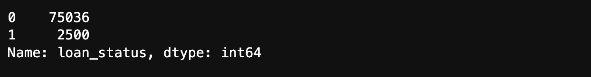
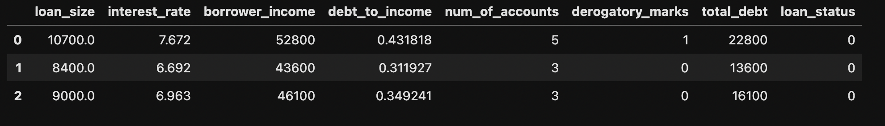
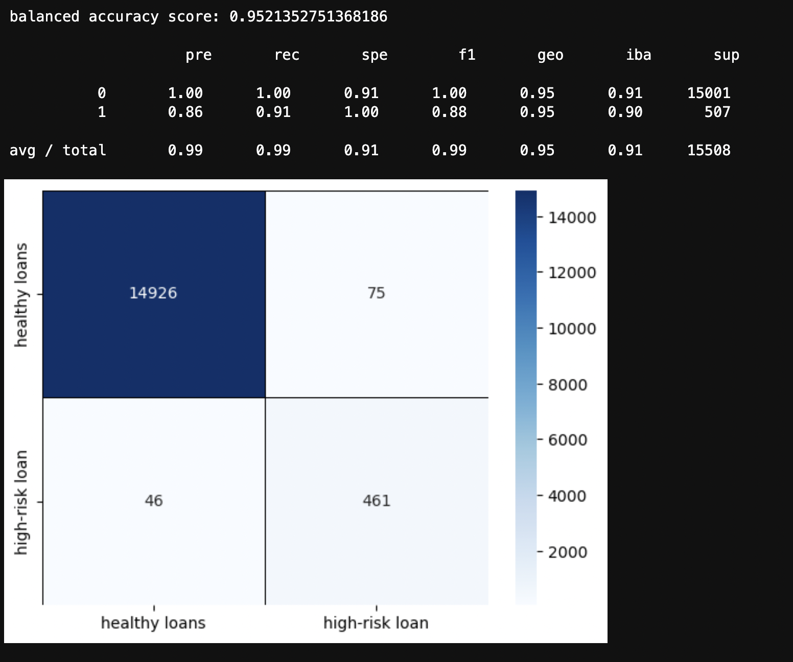
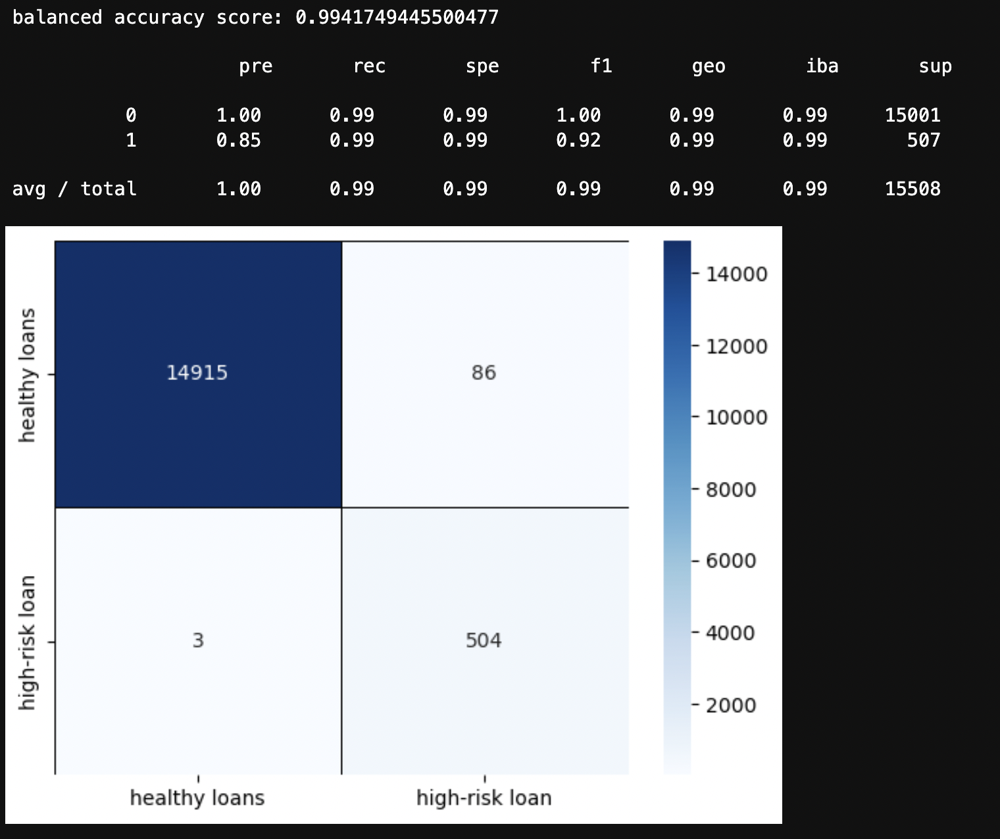
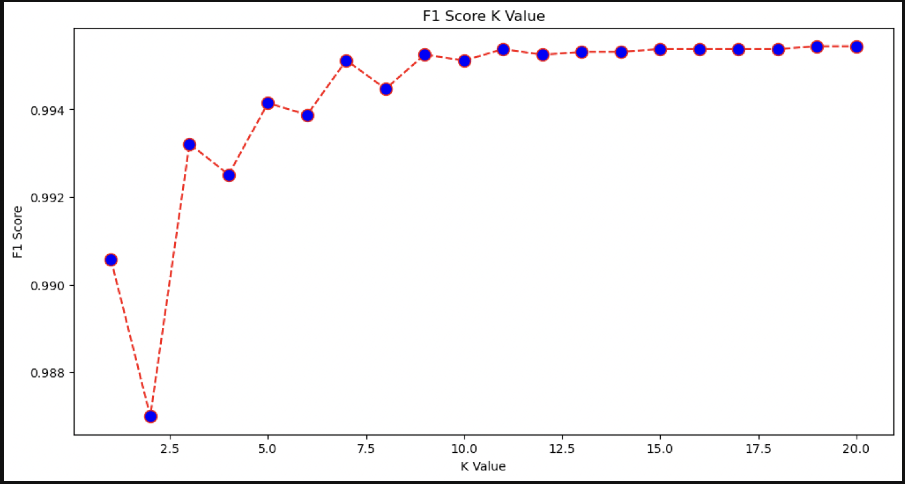
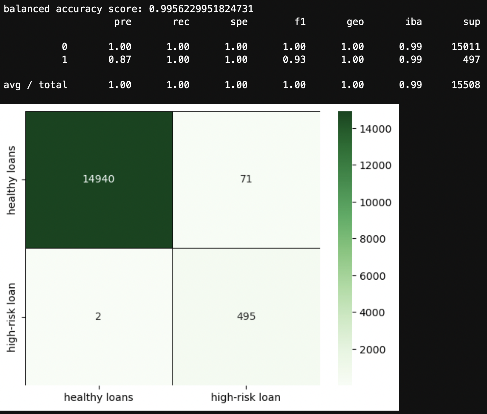

# Module 12 Challenge Report

## Analysis Overview

* Purpose

    Determination of creditworthiness in peer to peer lending industry such that losses might be minimized and profits maximized.  
    Various techniques were applied to train and evaluate supervised learning models with imbalanced classes to identify the creditworthiness of credit applicants (i.e. healthy loans vs high risk loans). 

* Financial information data and prediction objective/s.

    The dataset contains 75,036 healthy loans, and 2,500 high-risk loans
    
    The dataset contains 7 features (X) and one label/'target' (y) related to loan status as 'healthy'(class = 0) or 'high-risk' (class = 1)

* The stages of the machine learning process used as part of the analysis specific to the primary 'ask':

    Model 1
    
        Read in data
        create labels (y) set and features (X) dataframe
        Check for imbalance of labels/classes using value_counts()
        Split the data into train (80%) and test (20%) datasets using train_test_split;
        Fit/train a logistic regression model by using the training data (X_train and y_train); and
        Testing the predictive power of the model using the X_test data.
        Evaluate model's performance with balanced_accuracy_score, confusion_matrix, and classification_report_imbalanced
        
    Model 2
    
        re-use model 1 created labels (y) set and features (X) dataframe
        Instantiate the random oversampler model
        fit_resample the training data (X_train and y_train)
        Check for imbalance of resampled labels/classes using value_counts()
        Split the data into train (80%) and test (20%) datasets using train_test_split;
        Fit/train a logistic regression model by using the training data (X_resampled and y_resampled)
        Test the predictive power of the model using the X_test data.
        Evaluate model's performance with balanced_accuracy_score, confusion_matrix, and classification_report_imbalanced
        

* Some methods and/or specifics used:

        train_test_split(), test size specified 20%, random state specified 1
        RandomOverSampler(), random state specified 1
        LogisticRegression(), random state specified 1
        

## Results

* Machine Learning Model 1 - logistic regression with imbalanced (i.e. no resampling):

  balanced accuracy score: 0.9521 (95%)
  precision: 1 / 0.86 (i.e. healthy 0 vs high risk 1)
  recall: 1 / 0.91 (i.e. healthy 0 vs high risk 1)

* Machine Learning Model 2 - logistic regression, using resampled data (i.e. RandomOverSampler):

  balanced accuracy score: 0.9942 (99%)
  precision: 1 / 0.85 (i.e. healthy 0 vs high risk 1)
  recall: 0.99 / 0.99 (i.e. healthy 0 vs high risk 1)

## Summary

Using random oversampling to increase the minority class participation resulted in balanced accuracy improved from 0.9521 to 0.994, precision for high risk loans decreased slightly from 0.86 to 0.85, however the minimal decriment in precision was significantly offset with improved recall from 0.91 to 0.99 and f1 score from 0.88 to 0.92. Looking at the heatmap/confusion matrices, this translated into a decrease in adverse labeling of high risk loans as healthy loans; from 46 down to 3! Using the oversampling, the logistic regression model was able to better recognize the minority class (1) which was the unhealthy/'bad' loans. Overall, this benefits were achieved with only a small loss of identification of healthy/'good' loans; i.e. 75 to 86.  Given the potential for greater losses with fewer high risk loans being mis-classified as healthy, it is more critical in these circumstances to accurately identify the the minority (1) class.  All that said, if limited only to these two choices, I would choose the oversampled model.  However, given other options, I would choose neither. Please see Supplemental below for better option.

___

# SUPPLEMENTAL
___

    Model 3 (supplemental)
    
        Read in data
        create labels (y) set and features (X) dataframe
        Split the data into train (80%) and test (20%) datasets using train_test_split
        scaled features with StandardScaler()
        Fit/train a KNeighborsClassifier() model by using the training data (X_train and y_train)
        Test the predictive power of the model using the X_test data.
        Evaluate model's performance with balanced_accuracy_score, confusion_matrix, and classification_report_imbalanced
  

        Procede to hyperparameter optimization-
        loop run models from 1 to X neighbors, calculate the f1 and plot the number of K
        Plot the f1s
 

        Utilize built in numpy to calculate the maximum f1 and identify corresponding K  
        Using best K, fit/train a KNeighborsClassifier() model by using the training data (X_train and y_train)
        Test the predictive power of the model using the X_test data.
        Evaluate model's performance with balanced_accuracy_score, confusion_matrix, and classification_report_imbalanced
         

